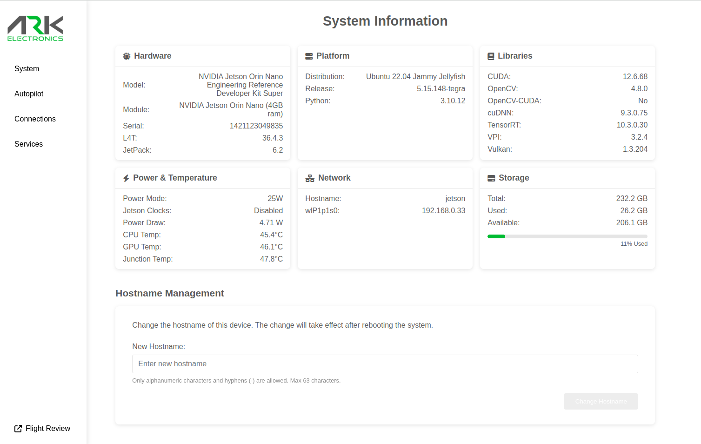
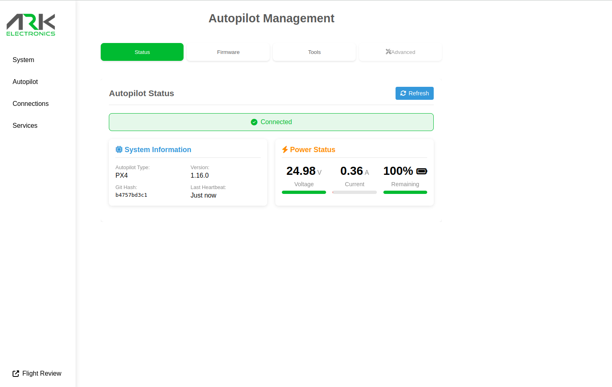
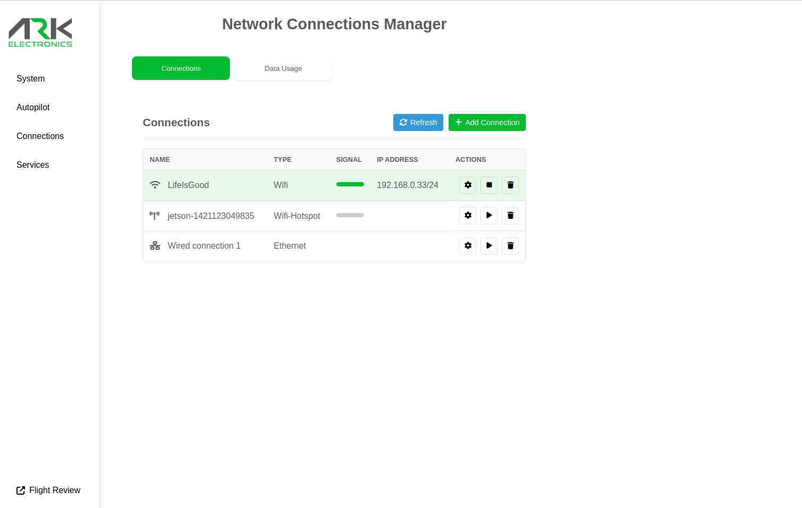
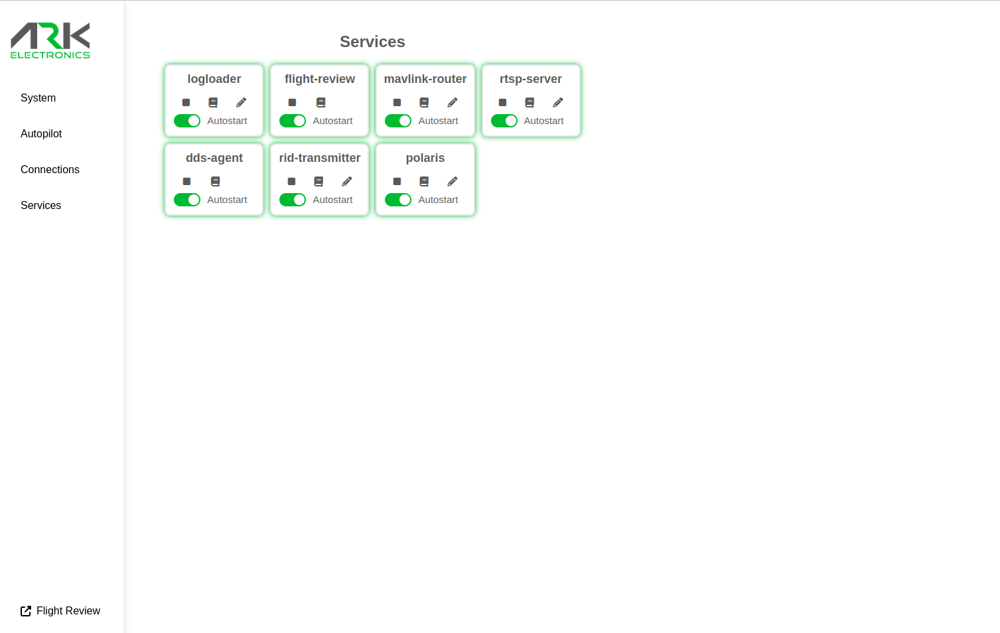

# About
ARK-OS is a collection of software services and tools for drones. These services provide essential features such as mavlink routing, video streaming, automatic flight log upload, flight controller firmware updating, network RTK corrections, and more.

#### Supported targets
- **ARK Jetson Carrier** <br> https://arkelectron.com/product/ark-jetson-pab-carrier/
- **ARK Pi6X Flow** <br> https://arkelectron.com/product/ark-pi6x-flow/
- **ARK Just a Pi** <br> https://arkelectron.com/product/ark-just-a-pi/

# Getting started
If you haven't set up an internet connection on your device, ssh in and connect to your wifi network.
```
ssh <user>@<hostname>.local
```

| User   | Password | Hostname |
|--------|----------|----------|
| jetson | jetson   | jetson   |
| pi     | pi       | pi6x     |

Connect to your WiFi network using Network Manager
```
sudo nmcli dev wifi connect <ssid> password <password>
```

# Installation

ARK-OS is distributed as a Debian package on the [Releases page](https://github.com/ARK-Electronics/ARK-OS/releases). The MAVSDK C++ SDK is bundled inside the package (see [MAVSDK](#mavsdk-bundled-usable-replaceable) below), so there is nothing to install separately and you are free to install your own MAVSDK system-wide without disturbing ARK-OS. On Jetson, the web UI's system stats additionally need `jetson-stats` (jtop) installed system-wide. The install script below handles all of this; manual steps follow if you prefer.

### Install / update with the script (recommended)

`packaging/install_ark_os.sh` installs `jetson-stats` (Jetson only) and ARK-OS in the correct order, and is also the supported way to update a live device. Run it from a checkout of this repo on the device:

```
git clone https://github.com/ARK-Electronics/ARK-OS.git
cd ARK-OS

# Download and install a published release (replace X.Y.Z):
sudo ./packaging/install_ark_os.sh --ark-os-version=X.Y.Z

# ...or install a .deb you already have (built locally or downloaded):
sudo ./packaging/install_ark_os.sh ./ark-os-jetson-jammy_X.Y.Z_arm64.deb
```

The script auto-detects Jetson vs Pi (override with `--platform`), skips jtop when it is already at the pinned version, and re-runs safely for updates. The versions it installs are pinned in `packaging/versions.env`. Run `sudo ./packaging/install_ark_os.sh --help` for all options.

### Manual install

MAVSDK is bundled inside the ARK-OS package, so you only install ARK-OS itself. Replace `<ark-os-ver>` and `<jetson-stats-ver>` with the versions pinned in `packaging/versions.env`. The ARK-OS package name includes your OS release codename — `jammy` for JetPack 6, `trixie` for Raspberry Pi OS (Debian 13) or `bookworm` (Debian 12) — so pick the asset matching your device's `/etc/os-release` `VERSION_CODENAME`.

#### Jetson
```
wget https://github.com/ARK-Electronics/ARK-OS/releases/download/v<ark-os-ver>/ark-os-jetson-jammy_<ark-os-ver>_arm64.deb

sudo apt install ./ark-os-jetson-jammy_<ark-os-ver>_arm64.deb

# Recommended: jtop, for Jetson system stats in the web UI
sudo apt install -y python3-pip && sudo pip3 install "jetson-stats==<jetson-stats-ver>"
```

#### Raspberry Pi
Identical, replacing `ark-os-jetson-jammy` with `ark-os-pi-trixie` for Raspberry Pi OS Trixie (Debian 13) — use `ark-os-pi-bookworm` on Debian 12. No jetson-stats step:
```
wget https://github.com/ARK-Electronics/ARK-OS/releases/download/v<ark-os-ver>/ark-os-pi-trixie_<ark-os-ver>_arm64.deb

sudo apt install ./ark-os-pi-trixie_<ark-os-ver>_arm64.deb
```

### MAVSDK: bundled, usable, replaceable

ARK-OS ships its own MAVSDK — runtime library, headers, and CMake config — under `/usr/lib/ark-os/mavsdk`, and its binaries load that copy via RUNPATH. The bundled copy is deliberately kept **off** the system linker path, so it is invisible to every other program on the device: you can `apt install`/`apt remove` a system `libmavsdk-dev`, or `make install` your own build to `/usr/local`, and neither ARK-OS nor your own MAVSDK programs are affected — the two copies coexist.

You can also build your own programs against the bundled SDK instead of installing MAVSDK yourself:

```cmake
find_package(MAVSDK REQUIRED)
target_link_libraries(your_app MAVSDK::mavsdk)
```

```
cmake -DCMAKE_PREFIX_PATH=/usr/lib/ark-os/mavsdk -B build && cmake --build build
```

Binaries run straight from the build tree work as-is (CMake's build RPATH covers them). If you `install` your program, set `CMAKE_INSTALL_RPATH=/usr/lib/ark-os/mavsdk/lib` so it finds the library at runtime. `pkg-config mavsdk` works too, via `PKG_CONFIG_PATH=/usr/lib/ark-os/mavsdk/lib/pkgconfig`. One caveat: the bundled MAVSDK tracks ARK-OS releases, so an ARK-OS upgrade may bump it under your program — if you need to pin your own MAVSDK version, install your own copy instead.

### Updating
Re-run `install_ark_os.sh` (it upgrades ARK-OS in place and leaves jtop alone when already current), or manually `sudo apt install ./ark-os-<platform>-<codename>_<ver>_arm64.deb`. **Upgrading resets the per-service configuration under `/etc/ark-os/` to packaged defaults** — reconfigure via the web UI afterward.

### Migrating from a source install
Installing the package on a device that was set up with the old `install.sh` flow migrates it automatically: the legacy user services and binaries are removed and your previous configs are backed up to `~/.config/ark-os-legacy-backup/`. **Reboot after installing** so no stale user-session services keep holding the autopilot UART / MAVLink ports.

### Building Jetson images
To install ARK-OS into a Jetson image during an `ark_jetson_kernel --provision` build (chroot), see `packaging/PLAN.md` Task 9.

## Command-line tools
The package puts its operator scripts on `PATH` via `/etc/profile.d/ark-os.sh`, which adds `/usr/lib/ark-os/scripts`. Each script's shebang points at the bundled venv (`/usr/lib/ark-os/venv/bin/python3`), so there is nothing to source or activate — open a login shell (e.g. SSH in) and run them by name:

```
mavlink_shell.py              # interactive PX4 NSH shell over MAVLink
px4_shell_command.py <cmd>    # run a single PX4 console command over MAVLink
flash_firmware.sh <fw.px4>    # flash FC firmware end to end (defaults to the bundled image)
px_uploader.py ...            # low-level uploader (bootloader must already be active)
reset_fmu_fast.py             # reset the FC (boots the application)
reset_fmu_wait_bl.py          # reset the FC into bootloader mode
jetson_serial_number.py       # print the Jetson carrier serial number (Jetson only)
can_check.py can0             # check DroneCAN traffic on a CAN interface (Jetson only)
check_cameras.sh              # stream-test the CSI cameras (Jetson only)
check_fan.sh                  # ramp + tachometer-check the cooling fan (Jetson only)
```

The directory also holds the service start-scripts and other internal helpers; the ones above are the operator-facing tools. The `PATH` entry takes effect on your next login — in the current shell, run `source /etc/profile.d/ark-os.sh` (or invoke a script by its full path under `/usr/lib/ark-os/scripts/`).

## ARK-UI
A web based UI is provided to more easily manage your device. The webpage is hosted with nginx and is available at http://jetson.local or http://pi6x.local.






## Services
The package installs the services below as system-level [systemd services](https://www.freedesktop.org/software/systemd/man/latest/systemd.service.html) running as the unprivileged platform user (`jetson` or `pi`). The always-on services are enabled automatically; the optional services (`dds-agent`, `logloader`, `polaris`, `flight-review`, `rid-transmitter`) are installed but disabled — enable them from the web UI or with `systemctl enable --now <service>`.

## Jetson and Pi

**mavlink-router.service** <br>
This service enables mavlink-router to route mavlink packets from the flight controller USB port to user defined UDP endpoints. You can add and remove endpoints using the service configuration enditor in the UI.

**dds-agent.service** <br>
The dds-agent service bridges the PX4 uORB and ROS2 topics. The bridged topics are defined in PX4 Firmware and can be [found here](https://github.com/PX4/PX4-Autopilot/blob/main/src/modules/uxrce_dds_client/dds_topics.yaml). The **dds-agent** runs the [micro-xrce-dds-agent](https://github.com/eProsima/Micro-XRCE-DDS-Agent) over the high speed serial connection between flight controller and Companion.

**logloader.service** <br>
This service downloads log files from the SD card of the flight controller via MAVLink and optionally uploads them to [PX4 Flight Review](https://review.px4.io/).

**flight-review.service** <br>
This service hosts a local PX4 Flight Review server on port 5006. All logloader downloaded logs are available here.

**rtsp-server.service** <br>
This service provides an RTSP server via gstreamer. The stream from the first connected CSI camera can be accessed by default at `rtsp://<hostname>.local:5600/camera1`.

**polaris.service** <br>
This service receives RTCM corrections from the PointOne GNSS Corrections service and publishes them to the flight controller via MAVLink.

**ark-ui-backend.service** <br>
This service provides an API gateway for the ARK UI.

**system-manager.service** <br>
This service provides a REST API for linux system management via the ARK UI.

**autopilot-manager.service** <br>
This service provides a REST API for autopilot management via the ARK UI.

**connecton-manager.service** <br>
This service provides a REST API for connection management via the ARK UI.

**service-manager.service** <br>
This service provides a REST API for systemd service management via the ARK UI.

### Jetson only

**rid-transmitter.service** <br>
This service starts the RemoteIDTransmitter service which broadcasts RemoteID data via Bluetooth.

**jetson-can.service** <br>
This service enables the Jetson CAN interface.
